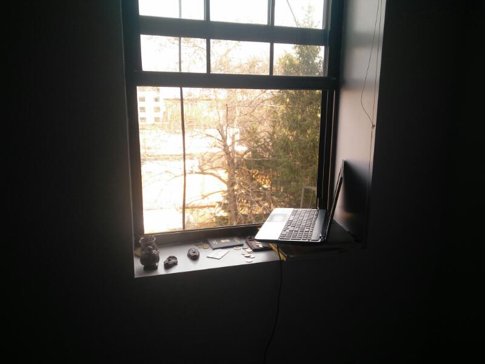
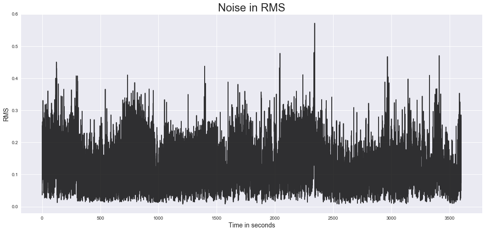
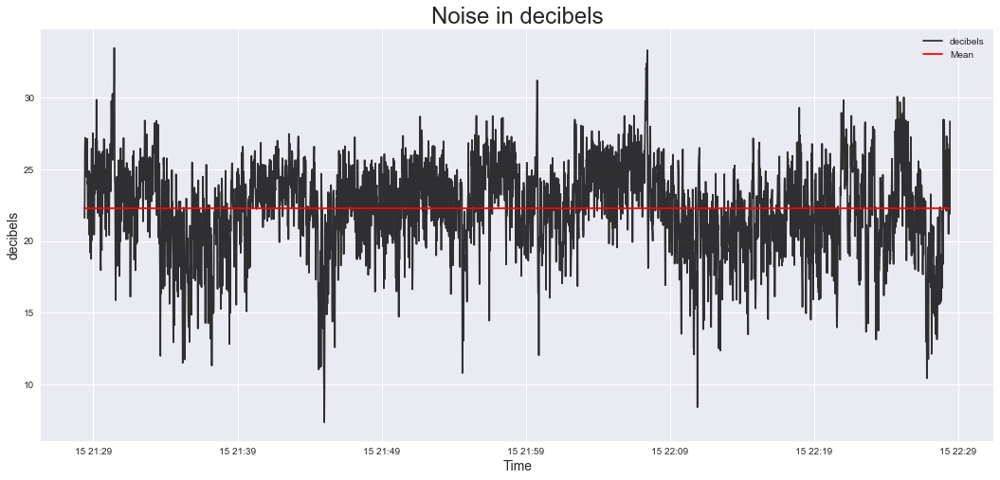

# NYU_CUSP_UrbanSoundSensing2017

## Author: Avikal Somvanshi (as10724)

### Assignment Task

This lecture introduces students to the fundamentals and application of sensing urban sound.

Gathering and making use of data from these environments requires knowledge of real-time data acquisition techniques and considerations when capturing and visualizing acoustic data. Time and frequency domain visualization approaches will be introduced, facilitated by a data collection initiative based around a “smart” sound sensing tool.

Prerequisites

* Knowledge of data I/O using Python libraries
* Visualization and handling of large datasets
* Basic understanding of multithreaded scripting

Assignment

Using the audio_record.py script, monitor the sound environment from the window of your apartment for around an hour.

As it is, the script will only print to the console if a certain level is exceeded. You need to modify it so that it logs `rms` to a CSV file with timestamps continuously. The level sampling occurs very quickly (~20/s) so you should also average this data using some kind of moving average. After this you can convert to decibels using the information on the slides.

Remember to switch off auto noise cancellation and auto gain control if they are on. Set the input gain to maximum in the OS settings. Before you start the process take some test measurements to ensure the system is working.

You need to provide a paragraph or two on the context around the measurement process, such as the conditions the laptop is setup in, distance to window, height above street level, intersection details, weather, pictures of the setup, time of day, etc etc. As much information as you can gather.

You can email me at: cmydlarz@nyu.edu if you have any questions

### Context

The experiment was conducted from the second storey apartment at the intersection of Franklin Ave and Clifton Place in Brooklyn. The interection is commerical with two bars, a taco joint and a live music venue. It is a really noisy conner and my home. The laptop was placed on the window sill of my bedroom and recording took place from 9:30pm to 10:30pm on Saturday.

### Result

#### Note: In absence of caliberation for this study, the lowest recorded rms during the study was used as reference for calculating decibels from recorded rms.